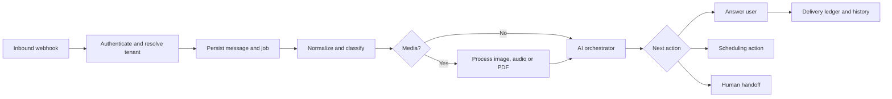

# ClinicsAI Automation — Case Study

A multi-tenant conversational automation project designed to support clinic operations through WhatsApp, AI-assisted conversations, scheduling and human handoff.

> **Current status:** logical release candidate under technical validation. The workflows have passed static checks, but production approval depends on staging tests, credential remapping and infrastructure review.

## Why I built it

Clinics often handle repetitive conversations across scheduling, reminders, follow-ups and basic questions. ClinicsAI explores how these interactions can be organized into reliable workflows while preserving tenant isolation and a clear path to human support.

## Main conversation flow

## Architecture highlights

- Durable message and job persistence before acknowledging the webhook.
- Multi-tenant context resolution and data isolation.
- Message normalization, classification and media routing.
- AI orchestration with idempotent business tools.
- Delivery ledger by operation and message fragment.
- Explicit `unknown` and `partial_failure` states for ambiguous external effects.
- Transactional claims with leases to reduce concurrent processing.
- Human handoff, appointment reminders and recurring care flows.
- Reconciliation workflow for operations that require manual evidence.

## Workflow modules

| Module | Responsibility |
|---|---|
| Inbound router | Authenticates, validates, records and queues events |
| Inbound worker | Processes new jobs and recovers abandoned work |
| AI orchestrator | Selects conversational and business actions |
| Media processor | Validates and processes images, audio and PDFs |
| Message sender | Tracks idempotent delivery operations and fragments |
| Handoff manager | Pauses automation and creates a human support handoff |
| Appointment reminders | Claims and sends reminders in controlled batches |
| Recurring care | Runs scheduled follow-up workflows |
| Tenant onboarding | Creates tenant configuration transactionally |
| Error handler | Sanitizes and deduplicates operational alerts |
| Reconciliation monitor | Creates cases for ambiguous external outcomes |

The current candidate contains **11 n8n workflows, 214 nodes and 248 connections**.

## Reliability decisions

### Duplicate delivery

An external message ID identifies the incoming event. Persistence and operation keys are used to avoid processing the same event or outbound action as new work. Repeated messages written intentionally by a user are still separate events because they receive different IDs.

### External side effects

The workflow does not blindly retry an outbound message POST. If the external provider does not confirm the result, the operation is recorded as `unknown` and sent to reconciliation instead of risking a duplicate message.

### Job recovery

Inbound jobs move through explicit states and use leases. Recoverable failures can return to the queue, while exhausted jobs move to a dead-letter state for investigation.

## Technology

- n8n
- JavaScript
- REST APIs and webhooks
- Supabase / PostgreSQL / SQL / RPCs
- OpenAI API
- WhatsApp integration through Evolution API
- Docker and Docker Compose

## What I learned

- Breaking a large automation into smaller workflows with clear responsibilities.
- The difference between retries that are safe and retries that can duplicate an external action.
- How message IDs, idempotency keys, claims and leases work together.
- Why webhook acknowledgement should happen only after durable persistence.
- How to document deployment order, rollback needs and validation gaps.

## My role and transparency

I designed and iterated on the workflow logic through hands-on implementation with AI-assisted technical review. I can explain the end-to-end business flow and the main architecture decisions, and I am continuing to deepen my JavaScript, SQL, debugging and infrastructure skills.

This public repository is a documentation-focused case study. Operational workflow exports are being withheld until credential review and staging validation are complete.

## Next validation steps

- Review and apply database migrations in staging.
- Remap n8n credentials and subworkflow identifiers.
- Execute the planned end-to-end test suite.
- Validate business rules and reconciliation procedures.
- Complete a separate infrastructure audit.

---

Built by [Natany Santos](https://github.com/nascimentonatanysantos-ops) · [LinkedIn](https://www.linkedin.com/in/natany-santos/)
